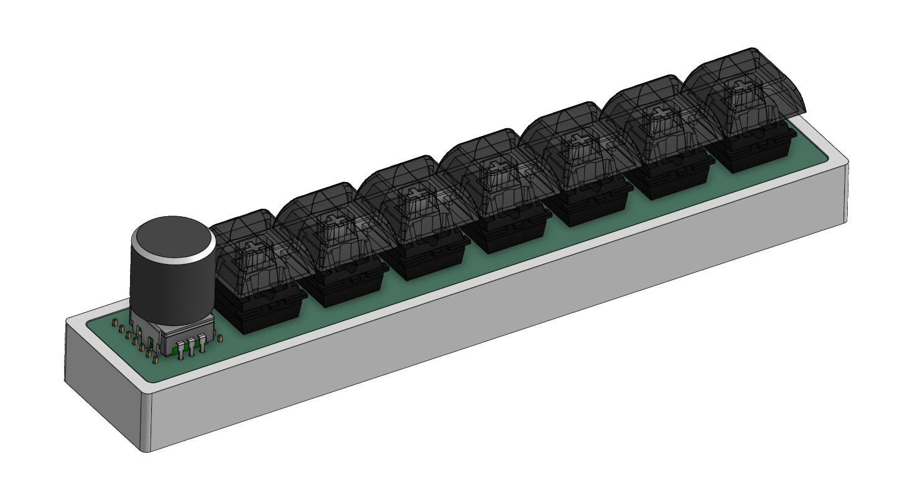
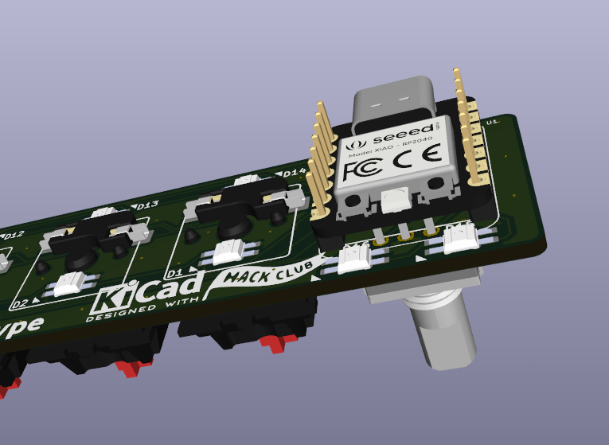
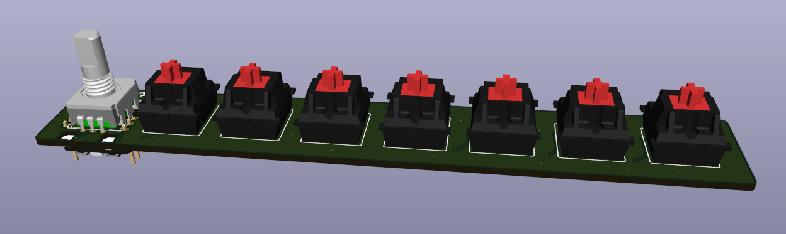
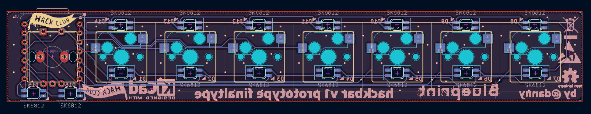
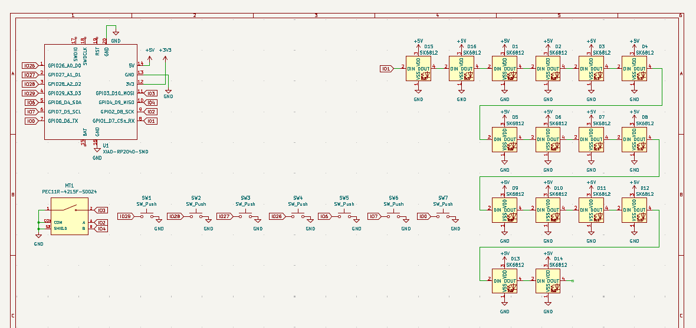

# hackbar

Hackbar is a macro keys pad in the shape of a bar designed to be placed on the long side of your keyboard. It features 7 switches, an encoder, and two neopixels per key and encoder. It is also inspired by the [Google g-board april fools video](https://www.youtube.com/watch?v=9G3DWHf1xX0). 

# CAD

The cad can be found on [onshape](https://cad.onshape.com/documents/5cba3b888e11db533a85f54f/w/c697cc47e3473bff9588772d/e/0aef22490cba32d3fbb4fb29?renderMode=0&uiState=698d35e3e8867af81a3cb232). 

# Why I Made It

I wanted a macro keyboard that felt like the media control boards used in the a/v industry. They feature toggled leds that are vibrant and bright and look satisfying. I also would like to share this board with some of my friends as its very simple and easy to understand.

# How to Use 

The Seeed Xiao RP2040 makes flashing code very easy through circuitpython on the usb-c. 

# Photos

# Bill of Materials

|Part              |Quantity|On hand|Price |
|------------------|--------|-------|------|
|DSA Keycaps       |7       |no     |      |
|Switches          |7       |no     |      |
|Rotary Encoder Cap|1       |no     |      |
|Rotary Encoder    |1       |no     |      |
|SK6812 MINI-E LEDs|16      |no     |      |
|PCB               |        |no     |$9.55 |
|Seeed XIAO RP2040 |1       |no     |      |
|3d Printed Case   |1       |yes    |      |
|Hot-swap Socket   |7       |yes    |      |